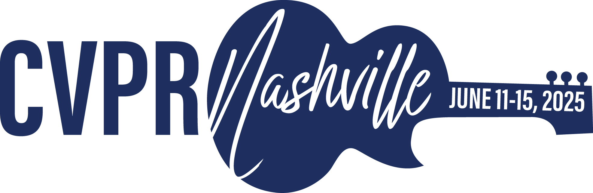
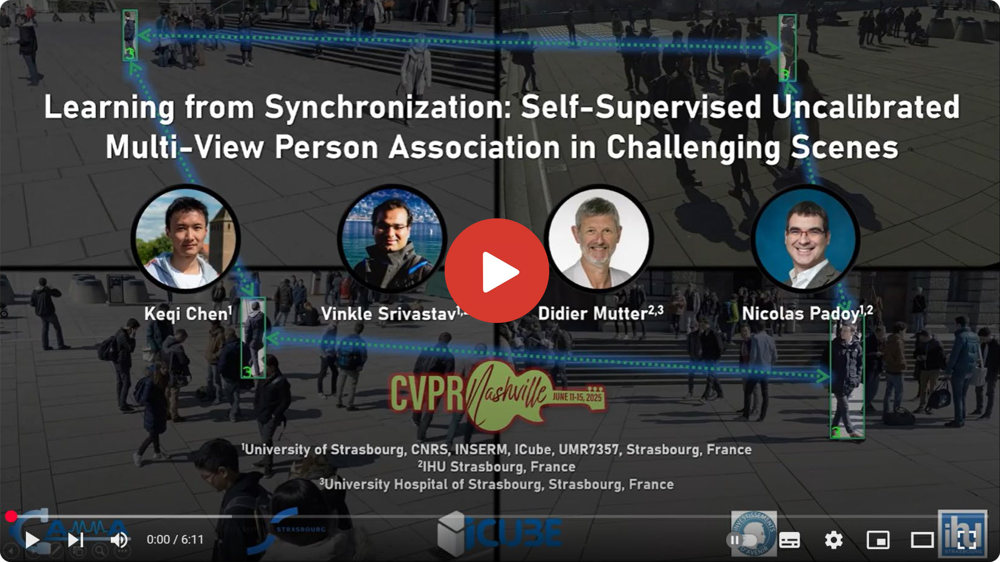
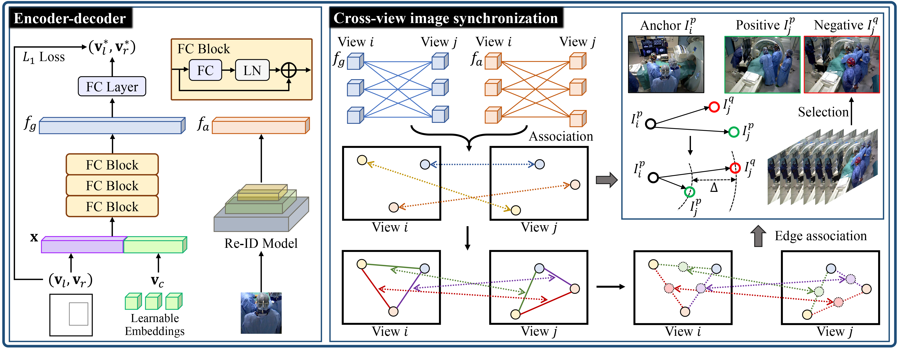

<div align="center">
<a href="http://camma.u-strasbg.fr/">

</a>
</div>

## **Learning from Synchronization: Self-Supervised Uncalibrated Multi-View Person Association in Challenging Scenes**
Keqi Chen, [Vinkle Srivastav](https://vinkle.github.io/), Didier Mutter, Nicolas Padoy, CVPR 2025

[](https://arxiv.org/abs/2503.13739)

<div align="center">
<a href="https://cvpr.thecvf.com/">

</a>
</div>

## Introduction

<div style="text-align: justify"> 
Multi-view person association is a fundamental step towards multi-view analysis of human activities. Although the person re-identification features have been proven effective, they become unreliable in challenging scenes where persons share similar appearances. Therefore, cross-view geometric constraints are required for a more robust association. However, most existing approaches are either fully-supervised using ground-truth identity labels or require calibrated camera parameters that are hard to obtain. In this work, we investigate the potential of learning from synchronization, and propose a self-supervised uncalibrated multi-view person association approach, Self-MVA, without using any annotations. Specifically, we propose a self-supervised learning framework, consisting of an encoder-decoder model and a self-supervised pretext task, cross-view image synchronization, which aims to distinguish whether two images from different views are captured at the same time. The model encodes each person's unified geometric and appearance features, and we train it by utilizing synchronization labels for supervision after applying Hungarian matching to bridge the gap between instance-wise and image-wise distances. To further reduce the solution space, we propose two types of self-supervised linear constraints: multi-view re-projection and pairwise edge association. Extensive experiments on three challenging public benchmark datasets (WILDTRACK, MVOR, and SOLDIERS) show that our approach achieves state-of-the-art results, surpassing existing unsupervised and fully-supervised approaches. 
</div>

### Self-MVA introduction video

[](https://www.youtube.com/watch?v=5eAd6yUgdZg "Self-MVA")

### Self-MVA overall framework


### Demo outputs
Sample outputs of __*Self-MVA*__ showing the performance on the WILDTRACK / MVOR / SOLDIERS datasets. 
<p float="center">  </p>

#### In this repo we provide:
- Training and testing code for Self-MVA, a state-of-the-art self-supervised uncalibrated multi-view person association method. 
- Trained models on the WILDTRACK / MVOR / SOLDIERS datasets. 

## Installation
1. Clone this repo, and we'll call the directory that you cloned as ${ROOT_DIR}.
2. Install dependencies. 
```shell
> conda create -n selfmva python=3.9
> conda activate selfmva
(selfmva)> conda install pytorch==1.13.1 torchvision==0.14.1 pytorch-cuda=11.7 -c pytorch -c nvidia
(selfmva)> pip install -r requirements.txt
```
3. Install Torchreid following [deep-person-reid](https://github.com/KaiyangZhou/deep-person-reid).

## Data preparation

### WILDTRACK dataset
1. Download the [WILDTRACK dataset](https://www.epfl.ch/labs/cvlab/data/data-wildtrack/) and place it in `./data/` as:
```
${ROOT_DIR}
|-- data
    |-- Wildtrack
        |-- sequence1
            |-- output
            |   |-- detections_train.json
            |-- src
            |   |-- annotations_positions
            |   |-- Image_subsets
```
2. Run command:
```bash
python ./ssl/preprocess.py --dataset Wildtrack
```

### MVOR dataset
1. Download the [MVOR dataset](https://github.com/CAMMA-public/MVOR), and place them in `./data/` as:
```
${ROOT_DIR}
|-- data
    |-- MVOR
        |-- sequence1
            |-- output
            |   |-- detections_train.json
        |-- camma_mvor_dataset
            |-- day1
            |-- day2
            |-- day3
            |-- day4
        |-- camma_mvor_2018_v2.json
```
2. Run command:
```bash
python ./ssl/preprocess.py --dataset MVOR
```

### SOLDIERS dataset
1. The original [SOLDIERS dataset](https://www.epfl.ch/labs/cvlab/data/soldiers-tracking/) are unprocessed videos. For convenience, we provide the [processed frames and annotations](https://s3.unistra.fr/camma_public/github/Self-MVA/data/soldiers.zip). Download and unzip in `./data/` as:
```
${ROOT_DIR}
|-- data
    |-- soldiers
        |-- output
            |-- frames
            |-- annotated_box_test.json
            |-- detections_train.json
```

### Models
1. Download the pre-trained models as follows. 
```shell
> wget https://s3.unistra.fr/camma_public/github/Self-MVA/weights/prompt_vit_h_4b8939.pth
> wget https://s3.unistra.fr/camma_public/github/Self-MVA/weights/osnet_ain_ms_d_c.pth.tar
```

2. Download the trained models on three datasets. 

|   Model      |  Model Weights |
| :----------: | :-----:   |
| [WILDTRACK](configs/wildtrack.yaml)| [download](https://s3.unistra.fr/camma_public/github/Self-MVA/weights/wildtrack_edge_geometry_reid.pth.tar) |
| [MVOR](configs/mvor.yaml)| [download](https://s3.unistra.fr/camma_public/github/Self-MVA/weights/mvor_edge_geometry_reid.pth.tar) |
| [SOLDIERS](configs/soldiers.yaml)| [download](https://s3.unistra.fr/camma_public/github/Self-MVA/weights/soldiers_geometry.pth.tar) |

The directory tree should look like this:
```
${ROOT_DIR}
|-- weights
|   |-- mvor_edge_geometry_reid.pth.tar
|   |-- osnet_ain_ms_d_c.pth.tar
|   |-- prompt_vit_h_4b8939.pth
|   |-- soldiers_geometry.pth.tar
|   |-- wildtrack_edge_geometry_reid.pth.tar
```

## Training
### WILDTRACK dataset
```
python ssl/main.py --cfg configs/wildtrack.yaml
```

### MVOR dataset
```
python ssl/main.py --cfg configs/mvor.yaml
```

### SOLDIERS dataset
```
python ssl/main.py --cfg configs/soldiers.yaml
```

## Evaluation
### WILDTRACK dataset
```
python ssl/main.py --test --cfg configs/wildtrack.yaml
```

### MVOR dataset
```
python ssl/main.py --test --cfg configs/mvor.yaml
```

### SOLDIERS dataset
```
python ssl/main.py --test --cfg configs/soldiers.yaml
```

## Tips for custom dataset
Currently, we do not support APIs for custom dataset training. If you want to use Self-MVA on your own dataset, you can follow the steps below:
1. Prepare multi-view images in the format of `{frame_id}_{camera_id}.jpg`. 
2. Generate human bounding boxes using any off-the-shelf detector with decent performance, and save the results as a json file, whose format should be: 
```
{frame_id: [[x1, y1, width, height, tracking_id (-1), camera_id], ...], ...}
```
3. Manually register the dataset in `./ssl/dataset.py`. 
4. Write the config file. 

## Citation
If you use our code or models in your research, please cite with:
```bibtex
@InProceedings{Chen_2025_CVPR,
    author    = {Chen, Keqi and Srivastav, Vinkle and Mutter, Didier and Padoy, Nicolas},
    title     = {Learning from Synchronization: Self-Supervised Uncalibrated Multi-View Person Association in Challenging Scenes},
    booktitle = {Proceedings of the IEEE/CVF Conference on Computer Vision and Pattern Recognition (CVPR)},
    month     = {June},
    year      = {2025},
    pages     = {24419--24428}
}
```

### References
The project uses [segment-anything](https://github.com/facebookresearch/segment-anything), [ReST](https://github.com/chengche6230/ReST) and [MvMHAT](https://github.com/realgump/MvMHAT). We thank the authors for releasing their codes. 

## License
This code and models are available for non-commercial scientific research purposes as defined in the [CC BY-NC-SA 4.0](https://creativecommons.org/licenses/by-nc-sa/4.0/). By downloading and using this code you agree to the terms in the [LICENSE](LICENSE). Third-party codes are subject to their respective licenses.
